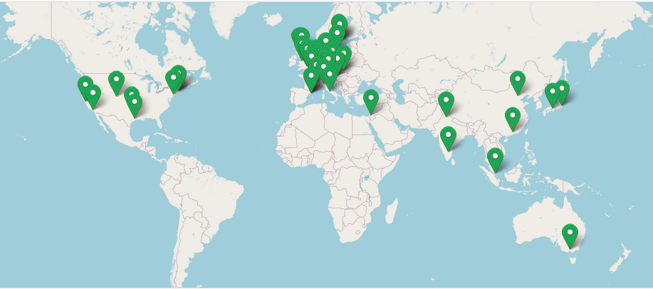

.. _nf-core_1-page:

.. image:: images/nf-core-logo.png
	:width: 400

Introduction to nf-core
=======================

nf-core is a community effort to collect a curated set of analysis pipelines built using Nextflow. As such nf-core is:

* A community of users and developers.

* A curated set of analysis pipelines build using Nextflow.

* A set of guidelines (standard).

* A set of helper tools.

Community
---------

The nf-core community is a collaborative effort that has been growing since its creation in early 2018, as you can check on
the `nf-core stats site <https://nf-co.re/stats/>`__.




Pipelines
---------

Currently, there are 66 pipelines that are available as part of nf-core (37 released, 23 under development and 6 archived). 
You can browse all of them on this `link <https://nf-co.re/pipelines>`__.

Guidelines
----------

All nf-core pipelines must meet a series of requirements or guidelines. These guidelines ensure that all nf-core pipelines
follow the same standard and stick to current computational standards to achieve reproducibility, interoperability and 
portability. The guidelines are make available on `this <https://nf-co.re/docs/contributing/guidelines>`__ link.

Helper tools
------------

To ease the use and development of nf-core pipelines, the community makes available a set of helper tools that we will
introduce on this tutorial.

Paper
-----

The main nf-core paper was published in 2020 in `Nature Biotechnology <https://pubmed.ncbi.nlm.nih.gov/32055031/>`__ and 
describes the community and the nf-core framework.

.. image:: images/nf-core-paper.png
	:width: 600


Installation
------------

You can use Conda to install nf-core tools, in the command below we create a new named environment that includes nf-core
and then, we activate it.

.. code-block:: console

	conda create --name nf-core nf-core=2.4.1 -c bioconda -c conda-forge -y 
	conda activate nf-core

.. note::	
	You will need to install again Nextflow in the instances using ``curl -s https://get.nextflow.io | bash`` and move the
	executable to ``sudo mv nextflow /usr/local/bin``

.. tip::
	Find alternative ways of installation on the nf-core `documentation <https://nf-co.re/tools/#installation>`__

We can now check nf-core available commands:

.. code-block:: console

	$ nf-core
                                          ,--./,-.
          ___     __   __   __   ___     /,-._.--~\
    |\ | |__  __ /  ` /  \ |__) |__         }  {
    | \| |       \__, \__/ |  \ |___     \`-._,-`-,
                                          `._,._,'

    nf-core/tools version 2.4.1 - https://nf-co.re


																																			
	Usage: nf-core [OPTIONS] COMMAND [ARGS]...                                                                                                
																																			
	nf-core/tools provides a set of helper tools for use with nf-core Nextflow pipelines.                                                     
	It is designed for both end-users running pipelines and also developers creating new pipelines.                                           
																																			
	╭─ Options ────────────────────────────────────────────────────────────────────────────────────────╮
	│  --version                   Show the version and exit.                                          │
	│  --verbose   -v              Print verbose output to the console.                                │
	│  --log-file  -l  <filename>  Save a verbose log to a file.                                       │
	│  --help      -h              Show this message and exit.                                         │
	╰──────────────────────────────────────────────────────────────────────────────────────────────────╯
	╭─ Commands for users ─────────────────────────────────────────────────────────────────────────────╮
	│  list      List available nf-core pipelines with local info.                                     │
	│  launch    Launch a pipeline using a web GUI or command line prompts.                            │
	│  download  Download a pipeline, nf-core/configs and pipeline singularity images.                 │
	│  licences  List software licences for a given workflow.                                          │
	╰──────────────────────────────────────────────────────────────────────────────────────────────────╯
	╭─ Commands for developers ────────────────────────────────────────────────────────────────────────╮
	│  create        Create a new pipeline using the nf-core template.                                 │
	│  lint          Check pipeline code against nf-core guidelines.                                   │
	│  modules       Commands to manage Nextflow DSL2 modules (tool wrappers).                         │
	│  schema        Suite of tools for developers to manage pipeline schema.                          │
	│  bump-version  Update nf-core pipeline version number.                                           │
	│  sync          Sync a pipeline TEMPLATE branch with the nf-core template.                        │
	╰──────────────────────────────────────────────────────────────────────────────────────────────────╯

As shown in the screenshot, nf-core tools provide with some commands meant for users and with some commands meant
for developers. We will start first discussing how nf-core can be used from a user point of view.

nf-core for users
=================

Listing pipelines
-----------------

To show all the nf-core available pipelines, we can use the nf-core list command. This command also
provides some other information as the last version of each of the nf-core pipelines, its publication and
and when you last pulled the pipeline to your local system.


.. code-block:: console

	$ nf-core list

                                          ,--./,-.
          ___     __   __   __   ___     /,-._.--~\
    |\ | |__  __ /  ` /  \ |__) |__         }  {
    | \| |       \__, \__/ |  \ |___     \`-._,-`-,
                                          `._,._,'

    nf-core/tools version 2.4.1 - https://nf-co.re


	┏━━━━━━━━━━━━━━━━━━━━━━━━┳━━━━━━━┳━━━━━━━━━━━━━━━━┳━━━━━━━━━━━━━━━┳━━━━━━━━━━━━━━┳━━━━━━━━━━━━━━━━━━━━━━┓
	┃ Pipeline Name          ┃ Stars ┃ Latest Release ┃      Released ┃  Last Pulled ┃ Have latest release? ┃
	┡━━━━━━━━━━━━━━━━━━━━━━━━╇━━━━━━━╇━━━━━━━━━━━━━━━━╇━━━━━━━━━━━━━━━╇━━━━━━━━━━━━━━╇━━━━━━━━━━━━━━━━━━━━━━┩
	│ airrflow               │    19 │          2.2.0 │    2 days ago │            - │ -                    │
	│ circdna                │     4 │          1.0.0 │    5 days ago │            - │ -                    │
	│ smrnaseq               │    39 │          2.0.0 │    5 days ago │ 7 months ago │ No (v1.1.0)          │
	│ rnaseq                 │   465 │          3.8.1 │   1 weeks ago │   6 days ago │ Yes (v3.8.1)         │
	│ ampliseq               │    88 │          2.3.2 │   1 weeks ago │            - │ -                    │
	│ mnaseseq               │     7 │          1.0.0 │   2 weeks ago │            - │ -                    │
	│ rnafusion              │    71 │          2.0.0 │   3 weeks ago │            - │ -                    │
	│ fetchngs               │    58 │            1.6 │   3 weeks ago │  2 weeks ago │ No (v1.5)            │
	│ atacseq                │   107 │          1.2.2 │   3 weeks ago │  2 weeks ago │ Yes (v1.2.2)         │
	│ mhcquant               │    19 │          2.3.1 │   4 weeks ago │            - │ -                    │
	│ hicar                  │     2 │          1.0.0 │  1 months ago │            - │ -                    │
	│ quantms                │     1 │            1.0 │  1 months ago │            - │ -                    │
	│ eager                  │    66 │          2.4.4 │  2 months ago │            - │ -                    │
	│ viralrecon             │    70 │          2.4.1 │  3 months ago │ 7 months ago │ No (v2.2)            │
	│ cutandrun              │    27 │            1.1 │  5 months ago │            - │ -                    │
	│ epitopeprediction      │    18 │          2.0.0 │  6 months ago │            - │ -                    │
	│ nanoseq                │    76 │          2.0.1 │  6 months ago │            - │ -                    │
	│ mag                    │    88 │          2.1.1 │  6 months ago │            - │ -                    │
	│ bacass                 │    35 │          2.0.0 │  9 months ago │            - │ -                    │
	│ bactmap                │    29 │          1.0.0 │ 12 months ago │            - │ -                    │
	│ sarek                  │   168 │          2.7.1 │ 12 months ago │ 2 months ago │ Yes (v2.7.1)         │
	[..truncated..]

.. tip::
	The pipelines can be sorted by latest release (``-s release``, default), by the last time you pulled a local copy 
	(``-s pulled``), alphabetically (``-s name``) or by the number of GitHub stars (``-s stars``).

Filtering available nf-core pipelines
-------------------------------------

It is also possible to use keywords after the ``list`` command so that the list of pipelines is shortened to those
matching the keywords or including them in the description. We can use the command below to filter on the **rna**
and **rna-seq** keywords:

.. code-block:: console
	
	$ nf-core list rna rna-seq

                                          ,--./,-.
          ___     __   __   __   ___     /,-._.--~\
    |\ | |__  __ /  ` /  \ |__) |__         }  {
    | \| |       \__, \__/ |  \ |___     \`-._,-`-,
                                          `._,._,'

    nf-core/tools version 2.4.1 - https://nf-co.re

	┏━━━━━━━━━━━━━━━━━━━━━━━━┳━━━━━━━┳━━━━━━━━━━━━━━━━┳━━━━━━━━━━━━━┳━━━━━━━━━━━━━━┳━━━━━━━━━━━━━━━━━━━━━━┓
	┃ Pipeline Name          ┃ Stars ┃ Latest Release ┃    Released ┃  Last Pulled ┃ Have latest release? ┃
	┡━━━━━━━━━━━━━━━━━━━━━━━━╇━━━━━━━╇━━━━━━━━━━━━━━━━╇━━━━━━━━━━━━━╇━━━━━━━━━━━━━━╇━━━━━━━━━━━━━━━━━━━━━━┩
	│ smrnaseq               │    39 │          2.0.0 │  5 days ago │ 7 months ago │ No (v1.1.0)          │
	│ rnaseq                 │   465 │          3.8.1 │ 1 weeks ago │   6 days ago │ Yes (v3.8.1)         │
	│ rnafusion              │    71 │          2.0.0 │ 3 weeks ago │            - │ -                    │
	│ dualrnaseq             │     7 │          1.0.0 │ 1 years ago │            - │ -                    │
	│ circrna                │    18 │            dev │           - │            - │ -                    │
	│ lncpipe                │    23 │            dev │           - │            - │ -                    │
	│ scflow                 │    12 │            dev │           - │            - │ -                    │
	│ spatialtranscriptomics │     3 │            dev │           - │            - │ -                    │
	└────────────────────────┴───────┴────────────────┴─────────────┴──────────────┴──────────────────────┘


Pulling pipelines
-----------------

Once we have identified the nf-core pipeline we want to use we can pull it using the Nextflow `built-in functionality <https://www.nextflow.io/docs/latest/sharing.html#pulling-or-updating-a-project>`__.

.. code-block:: console

	nextflow pull nf-core/<PIPELINE>

.. tip::
	Nextflow will also automatically pull a project if you use ``nextflow run nf-core/<PIPELINE>``

Launching pipelines
-------------------

The ``launch`` command enables to launch nf-core, and also Nextflow, pipelines via a web-based graphical interface or an
interactive command-line wizard tool. This command becomes handy for pipelines with a considerable number of parameters 
since it displays the documentation alongside each of the parameters and validate your inputs.

We can now launch an nf-core pipeline:

.. code-block:: console

	nf-core launch

.. note::
	The pipelines can be sorted by latest release (``-s release``, default), by the last time you pulled a local copy 
	(``-s pulled``), alphabetically (``-s name``) or by the number of GitHub stars (``-s stars``).

To render the description of the parameters, its grouping and defaults, the tool uses the ``nextflow_schema.json``. This
JSON file is bundled with the pipeline and includes all the information mentioned above, see an example `here <https://github.com/nf-core/rnaseq/blob/03d17893618c44075e4c91d83dc0e72b58f6f0f7/nextflow_schema.json>`__.

The chosen not default parameters are dumped into a JSON file called ``nf-params.json``. This file can be provided to new 
executions using the ``-params-file`` flag. See below an example:

.. literalinclude:: ../nf-core/examples/nf-params.json
	:language: json

It is a good practice in terms of reproducibility to explicitly indicate the version (revision) of the pipeline that 
you want to use, this can be indicated using the `-r` flag e.g. ``nf-core launch rnaseq -r 3.8.1``.

Exercise
********

Pull version ``3.8.1`` of the nf-core/rnaseq pipeline, run it using the ``nf-core launch`` command and produce the ``nf-params.json``.

.. raw:: html

	<details>
	<summary><a>Solution</a></summary>

.. code-block:: console

	nextflow pull nf-core/rnaseq -r 3.8.1
	nf-core launch rnaseq -r 3.8.1

nf-core configs and profiles
----------------------------

nf-core configs
***************

We have already introduced Nextflow configuration files and profiles during the course. Config files are used by 
nf-core pipelines to specify the computational requirements of the pipeline, define custom parameters and set which 
software management system to be used (Docker, Singularity or Conda). As an example take a look to the `base.config <https://github.com/nf-core/smrnaseq/blob/master/conf/base.config>`__
that is used to set sensible defaults for the computational resources needed by the pipeline. 

nf-core core profiles
*********************

nf-core pipelines use profiles to bundle a set of configuration attributes. By doing so, we can activate these 
attributes by using the ``-profile`` Nextflow command line option.  All nf-core pipelines come along with a set of common 
"Core profiles" that include the ``conda``, ``docker`` and ``singularity`` that define which software manager to use and the
``test`` profile that specifies a minimal test dataset to check that the pipelines works properly.

.. note:: 
	Each configuration file can include one or several profiles

Institutional profiles
**********************

Institutional profiles are profiles where you can specify the configuration attributes for your institution system. They are
hosted in https://github.com/nf-core/configs and all pipelines pull this repository when a pipeline is run. The idea is that
these profiles set the custom config attributes to run nf-core pipelines in your institution (scheduler, container technology,
resources, etc.). This way all the users in a cluster can make use of the profile just setting the profile of your institution 
(``-profile institution``).

.. tip::
	You can use more than profile at a time by separating them by a comma without space, e.g. ``-profile test,docker``

Custom config
*************

If you need to provide any custom parameter or setting when running a nf-core pipeline, you can do it by creating a local custom 
config file and add it to your command with the ``-c`` flag.

.. image:: images/nfcore_config.png
	:width: 600

.. note::	
	Profiles will be prioritized from left to right in case conflicting settings are found.	 

Exercise
********

* 1 - Create a custom config that sets ``params.email`` to your email address and try to run the pipeline.

.. * 2 - Create a custom config that sets the process cpus to 1 and the memory to 500 Mb.

.. * 3 - Why do you think the ``NFCORE_RNASEQ:RNASEQ:PREPARE_GENOME:GUNZIP_GTF`` process stills complains about not having enough CPUs?

.. raw:: html

	<details>
	<summary><a>Solution</a></summary>

.. code-block:: console

	params.email = "youremail@address.com"

.. raw:: html

	</details>
|
|

Running pipelines with test data
--------------------------------

All nf-core pipelines include a special configuration named ``test``. This configuration defines all the files and parameters to test
all pipeline functionality with a minimal dataset. Thus, although the functionality of the pipeline is maintained often the results
are not meaningful. As an example, find on the snippet below the test configuration of the `nf-core/rnaseq <https://github.com/nf-core/rnaseq/>`__`
pipeline.

.. literalinclude:: ../nf-core/examples/test.config
	:language: groovy

.. tip::
	You can find the current version of the above config above `here <https://github.com/nf-core/rnaseq/blob/master/conf/test.config>`__

Downloading pipelines
---------------------

If your HPC system or server does not have an internet connection you can still run nf-core pipelines by fetching the
pipeline files first and then, manually transferring them to your system. 

The ``nf-core download`` option simplifies this process and ensures the correct versioning of all the code and containers
needed to run the pipeline. By default, the command will download the pipeline code and the institutional `nf-core/configs <https://github.com/nf-core/configs>`__ 
files. Again, the ``-r`` flag allows to fetch a given revision of the pipeline.

Finally, you can also download any singularity image files required by the pipeline, if you specify the ``--singularity`` flag.

.. tip::
	If you don't provide any option to ```nf-core download`` an interactive prompt will ask you for the required options.

We can now try to download the rnaseq pipeline using the command below:

.. code-block:: console

	nf-core download rnaseq

Now we can inspect the structure of the downloaded directory:

.. code-block:: console

	$ tree -L 2 nf-core-rnaseq-3.8.1/

	nf-core-rnaseq-3.8.1/
	├── configs
	│   ├── ..truncated..
	│   ├── nextflow.config
	│   ├── nfcore_custom.config
	│   └── pipeline
	├── singularity-images
	│   ├── depot.galaxyproject.org-singularity-bbmap-38.93--he522d1c_0.img
	│   ├── ..truncated..
	│   └── depot.galaxyproject.org-singularity-umi_tools-1.1.2--py38h4a8c8d9_0.img
	└── workflow
		├── CHANGELOG.md
		├── ..truncated..
		├── main.nf
		├── modules
		└── workflows

.. Exercise
.. ********

.. Launch the nf-core chipseq pipeline dev branch --> you need to first do a nextflow pull
.. Check if this can be done using nf-core launch?

.. nf-core modules
.. ---------------

.. Fix corrupted pipeline

.. N E X T F L O W  ~  version 22.04.0
.. Can't find git repository config file -- Repository may be corrupted: .nextflow/assets/nf-core/atacseq
.. explain -r ~/.nextflow/assets/nf-core/chipseq/

.. explain the multiqc report in terms of reproducibility??